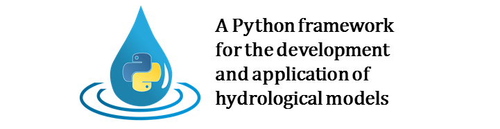

.. _`online documentation`: https://hydpy-dev.github.io/hydpy/
.. _Python: http://www.python.org/
.. _Cython: http://www.cython.org/
.. _`Ruhr-University Bochum`: http://www.hydrology.ruhr-uni-bochum.de/index.html.en
.. _`Björnsen Consulting Engineers`: https://www.bjoernsen.de/index.php?id=bjoernsen&L=2
.. _`GitHub repository`: https://github.com/hydpy-dev/hydpy
.. _`GNU Lesser General Public License 3`: https://www.gnu.org/licenses/lgpl-3.0.en.html
.. _`documentation test`: https://docs.python.org/3.6/library/doctest.html

.. image:: https://img.shields.io/pypi/v/HydPy
   :alt: PyPI
   :target: https://pypi.org/project/HydPy
.. image:: https://img.shields.io/pypi/v/HydPy?label=download
   :alt: Releases
   :target: https://github.com/hydpy-dev/hydpy/releases
.. image:: https://img.shields.io/badge/docs-latest-informational
   :alt: Documentation
   :target: https://hydpy-dev.github.io/hydpy/index.html
.. image:: https://img.shields.io/github/license/hydpy-dev/hydpy?color=blue
   :alt: GitHub
   :target: https://github.com/hydpy-dev/hydpy/blob/master/LICENSE

\

.. image:: https://img.shields.io/badge/Coverage-100%20%25-green
   :alt: Coverage
   :target: https://coverage.readthedocs.io
.. image:: https://img.shields.io/badge/Black-All%20done%21-green
   :alt: Black
   :target: https://github.com/psf/black
.. image:: https://img.shields.io/badge/Pylint-10.00/10-green
   :alt: Pylint
   :target: https://www.pylint.org/
.. image:: https://img.shields.io/badge/Mypy-work%20in%20progress-orange
   :alt: Mypy
   :target: https://mypy.readthedocs.io/en/stable

\

.. image:: https://img.shields.io/travis/hydpy-dev/hydpy/master?label=Travis%20master
   :alt: Travis master
   :target: https://app.travis-ci.com/github/hydpy-dev/hydpy/branches
.. image:: https://img.shields.io/travis/hydpy-dev/hydpy?label=latest
   :alt: Travis latest
   :target: https://app.travis-ci.com/hydpy-dev/hydpy

\

.. image:: https://img.shields.io/appveyor/build/tyralla/hydpy-hep1s/master?label=AppVeyor%20master
   :alt: AppVeyor master
   :target: https://ci.appveyor.com/project/tyralla/hydpy-hep1s/history
.. image:: https://img.shields.io/appveyor/build/tyralla/hydpy-hep1s?label=latest
   :alt: AppVeyor latest
   :target: https://ci.appveyor.com/project/tyralla/hydpy-hep1s

\

.. image:: https://img.shields.io/github/issues-raw/hydpy-dev/hydpy
   :alt: GitHub issues
   :target: https://github.com/hydpy-dev/hydpy/issues?q=is%3Aopen+is%3Aissue
.. image:: https://img.shields.io/github/issues-closed-raw/hydpy-dev/hydpy?label=closed
   :alt: GitHub closed issues
   :target: https://github.com/hydpy-dev/hydpy/issues?q=is%3Aissue+is%3Aclosed

*HydPy* is an interactive framework for developing and applying
different types of hydrological models, originally developed
at the `Ruhr-University Bochum`_ for specific research purposes.
Later it was extended on behalf of the `German Federal Institute of
Hydrology`_ in order to be applicable in practical applications like
runoff forecasting in large river basins.  Now it is being maintained
by `Björnsen Consulting Engineers`_.

*HydPy* is intended to be a modern open source software, based on the
programming language `Python`_, commonly used in many scientific fields.
Through using different well-established `Python`_ libraries and design
principles, we target high quality and transparency standards. To avoid
writing model cores in a more native programming language, *HydPy*
includes a `Cython`_ based mechanism to automatically translate
Python code to C code and to compile it.

*HydPy* has no graphical user interface (so far). Instead, it is thought
to be applied by executing Python scripts. These scripts help to increase
the reproducibility of studies performed with *HydPy* because
they can be easily shared and repeatedly executed.  This approach facilitates
discussing possible weaknesses of *HydPy* and its implemented
models and comparing different methodical approaches (e. g. different
strategies to calibrate model parameters).  However, if you are not an
experienced hydrologist with basic programming skills, you may need
some help to become acquainted with *HydPy*.

We host *HydPy* in a `GitHub repository`_ and everyone
is allowed to download, modify, and use it.  However, when passing the
(possibly modified) code to third parties, you have to be aware you
cannot change the selected `GNU Lesser General Public License 3`_
to a "less open source" license.  If you, for example, implement a model
into *HydPy*, you can be sure that all possible further developments of
your model code are still open source and the mentioned third parties
are allowed to pass this modified source code to you.

*HydPy* offers many functionalities to make the implemented
models as transparent and reliable as possible.  For this reason,
the `online documentation`_ is automatically updated for each new
*HydPy* version and includes different `documentation test`_ mechanisms
ensuring that *HydPy* is working as expected and that the complete
documentation is up-to-date with it.
